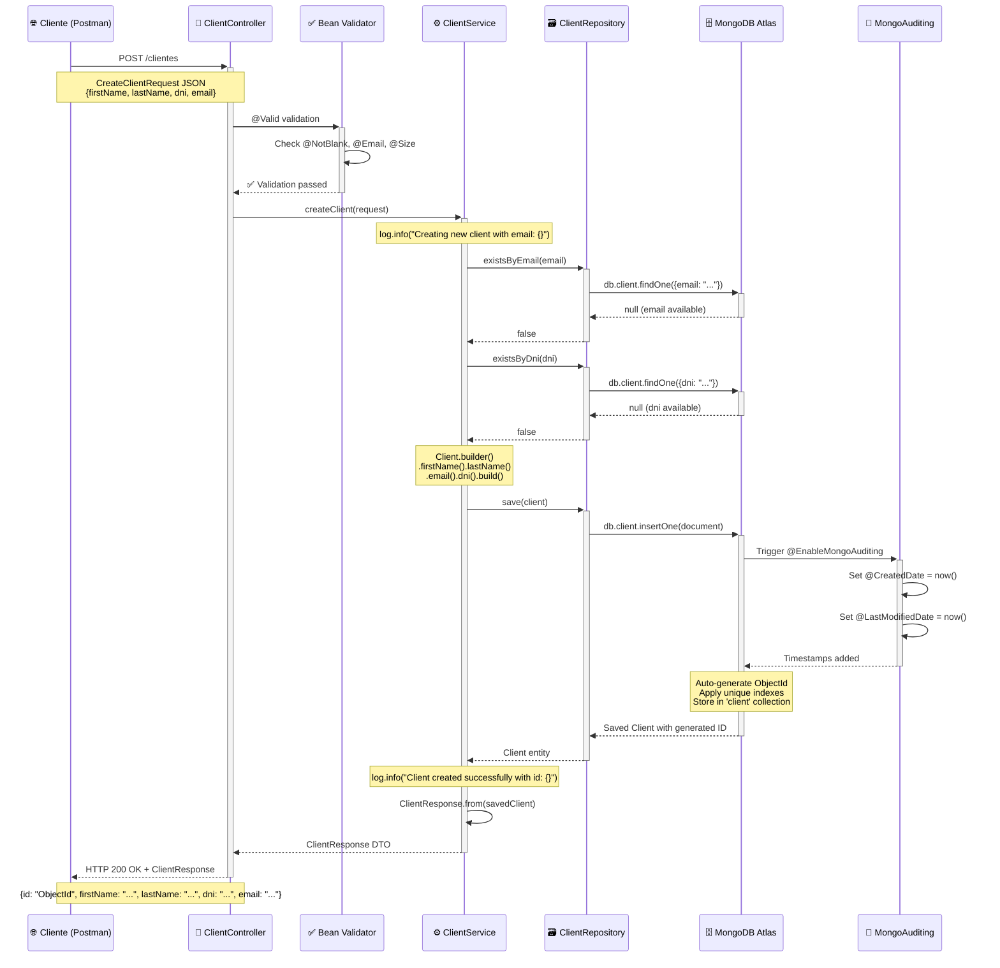
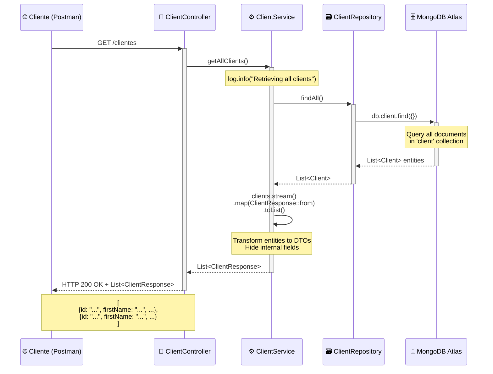
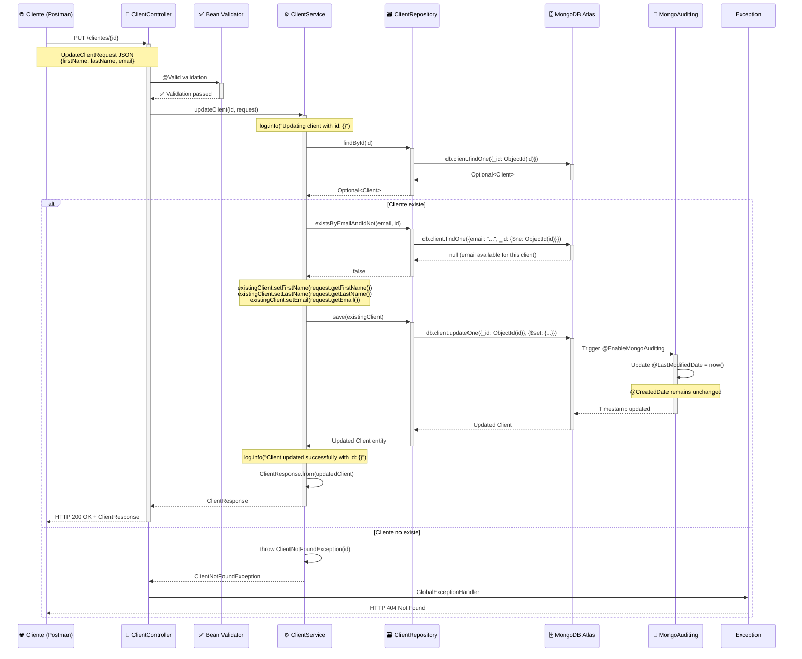
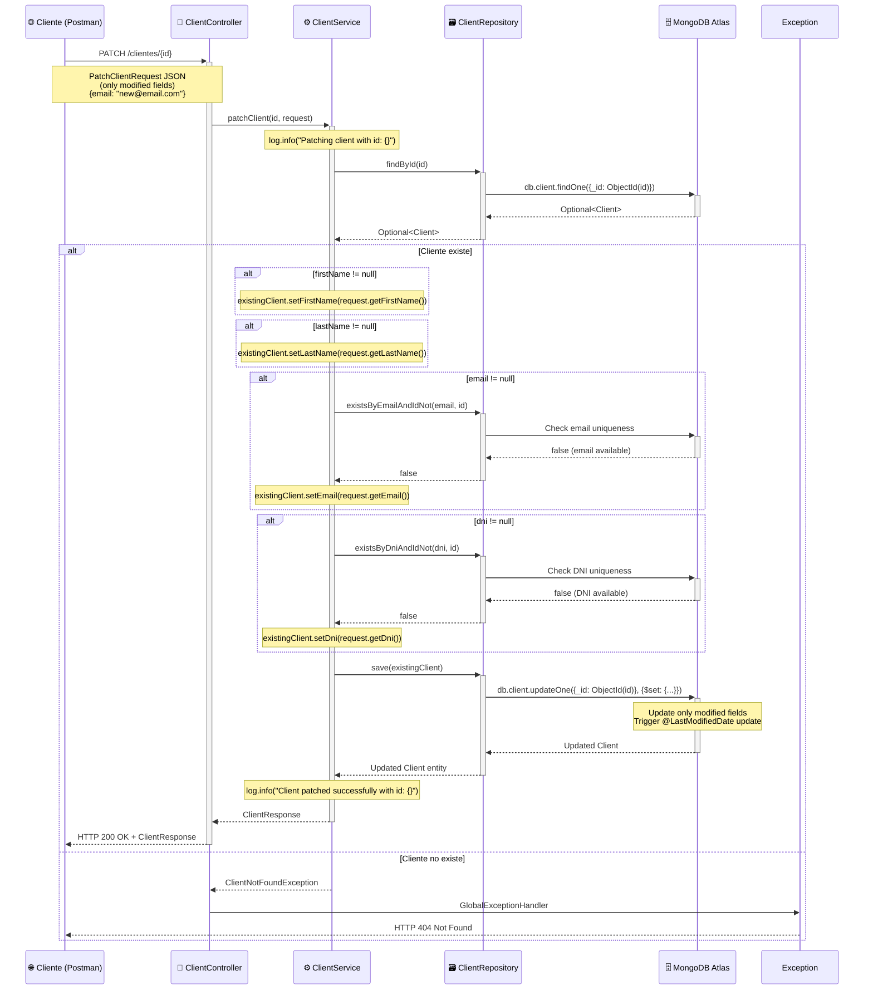
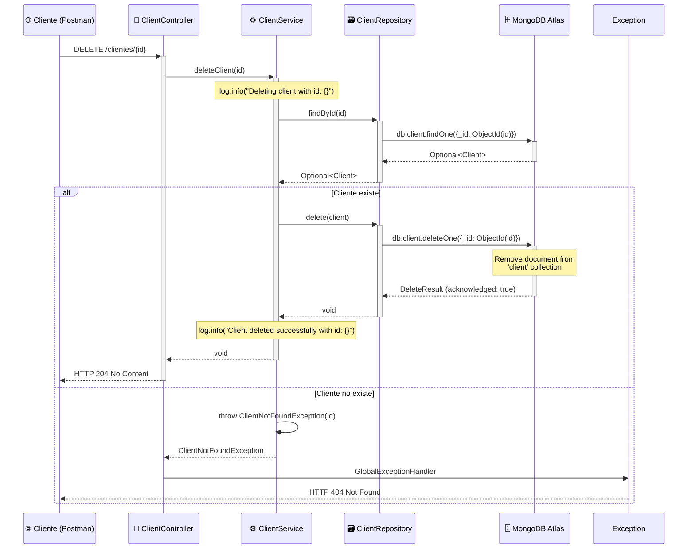
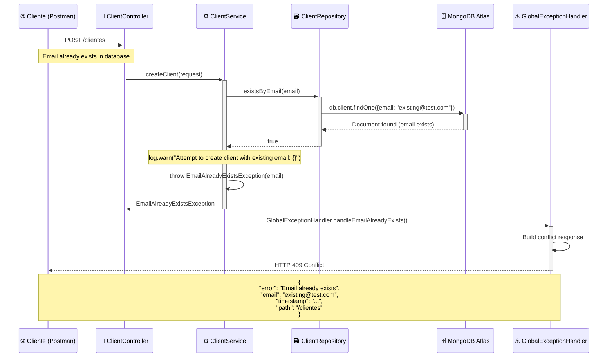
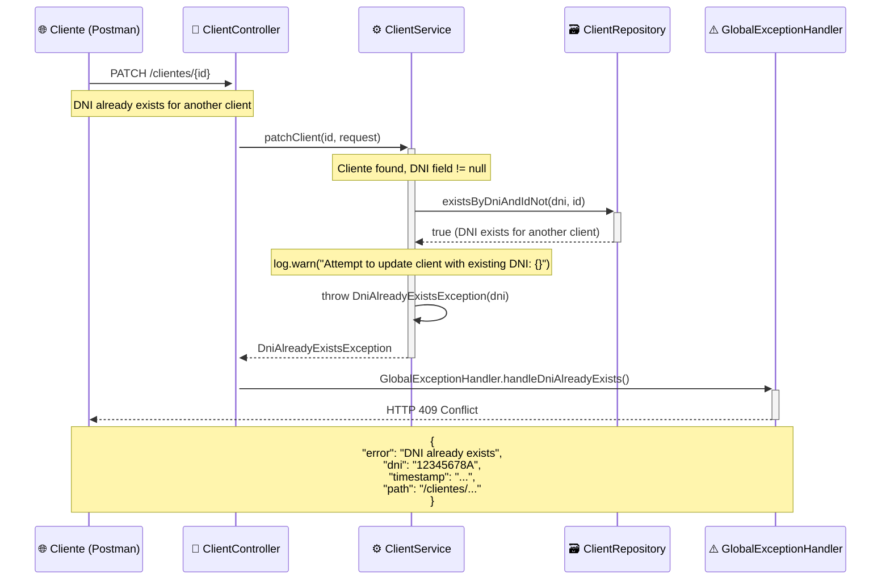
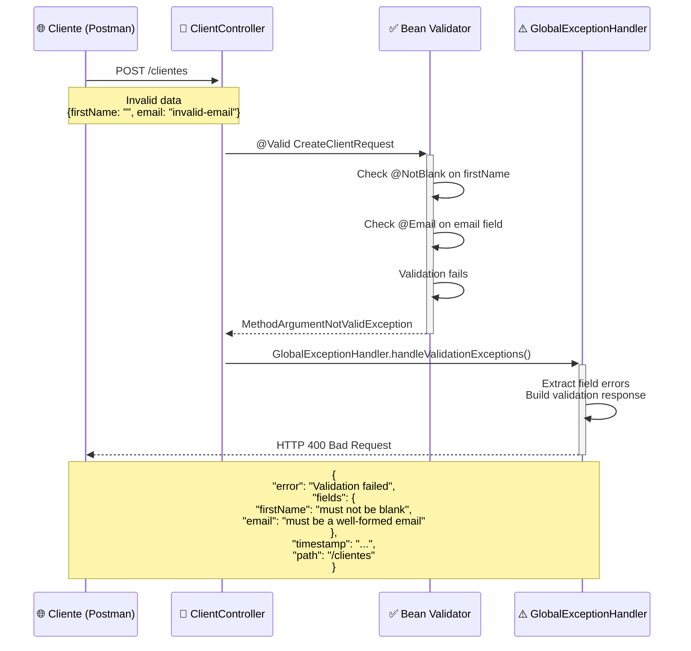
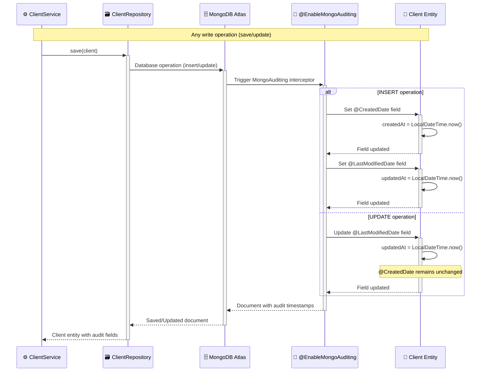

# 📊 Diagramas de Secuencia - Microservicio Client Management

Este archivo contiene los diagramas de secuencia detallados del microservicio de gestión de clientes, mostrando el flujo completo de cada operación CRUD.

## 🎯 Operaciones Documentadas

1. **Crear Cliente (POST /clientes)** - Flujo exitoso y con errores
2. **Listar Clientes (GET /clientes)** - Obtener todos los clientes
3. **Obtener Cliente por ID (GET /clientes/{id})** - Búsqueda individual
4. **Actualizar Cliente Completo (PUT /clientes/{id})** - Actualización total
5. **Actualizar Cliente Parcial (PATCH /clientes/{id})** - Actualización parcial
6. **Eliminar Cliente (DELETE /clientes/{id})** - Eliminación
7. **Flujos de Error** - Manejo de excepciones y validaciones

---

## 1. 📝 Crear Cliente - Flujo Exitoso



---

## 2. 📋 Listar Todos los Clientes



---

## 3. 🔍 Obtener Cliente por ID

```mermaid
sequenceDiagram
    participant Client as 🌐 Cliente (Postman)
    participant Controller as 📡 ClientController
    participant Service as ⚙️ ClientService
    participant Repository as 🗃️ ClientRepository
    participant MongoDB as 🗄️ MongoDB Atlas
    participant Exception as ⚠️ GlobalExceptionHandler

    Client->>+Controller: GET /clientes/{id}
    Note over Client,Controller: PathVariable: String id (ObjectId)
    
    Controller->>+Service: getClientById(id)
    Note over Service: log.info("Retrieving client with id: {}")
    
    Service->>+Repository: findById(id)
    Repository->>+MongoDB: db.client.findOne({_id: ObjectId(id)})
    MongoDB-->>-Repository: Optional<Client>
    Repository-->>-Service: Optional<Client>
    
    alt Cliente encontrado
        Service->>Service: ClientResponse.from(client)
        Service-->>-Controller: ClientResponse
        Controller-->>-Client: HTTP 200 OK + ClientResponse
        Note over Client,Controller: {id: "...", firstName: "...", lastName: "...", dni: "...", email: "..."}
    else Cliente no encontrado
        Service->>Service: throw ClientNotFoundException(id)
        Service-->>-Controller: ClientNotFoundException
        Controller->>+Exception: GlobalExceptionHandler.handleClientNotFound()
        Exception->>Exception: Build error response
        Exception-->>-Client: HTTP 404 Not Found
        Note over Client,Exception: {<br/>"error": "Client not found with id: ...",<br/>"timestamp": "...",<br/>"path": "/clientes/..."<br/>}
    end
```

---

## 4. ✏️ Actualizar Cliente Completo (PUT)



---

## 5. 🔧 Actualizar Cliente Parcial (PATCH)



---

## 6. 🗑️ Eliminar Cliente



---

## 7. ⚠️ Flujos de Error - Validaciones de Negocio

### 7.1 Error: Email Duplicado



### 7.2 Error: DNI Duplicado



### 7.3 Error: Validación de Entrada



---

## 8. 🔄 Flujo de Auditoría MongoDB



---

## 📊 Componentes del Microservicio

### **Participantes en los Diagramas:**

| **Participante** | **Tipo** | **Responsabilidad** |
|------------------|----------|---------------------|
| 🌐 **Cliente (Postman)** | API Consumer | Consumidor de la API REST |
| 📡 **ClientController** | REST Controller | Manejo de requests HTTP, validación |
| ✅ **Bean Validator** | Validation Framework | Validaciones automáticas (@Valid) |
| ⚙️ **ClientService** | Business Service | Lógica de negocio, validaciones de dominio |
| 🗃️ **ClientRepository** | Data Repository | Abstracción de acceso a datos |
| 🗄️ **MongoDB Atlas** | Database | Persistencia en la nube |
| 📝 **MongoAuditing** | Auditing System | Timestamps automáticos |
| ⚠️ **GlobalExceptionHandler** | Exception Handler | Manejo centralizado de errores |

### **Flujos de Datos Implementados:**

✅ **Request Flow**: Cliente → Controller → Service → Repository → MongoDB
✅ **Response Flow**: MongoDB → Repository → Service → Controller → Cliente  
✅ **Error Flow**: Exception → GlobalExceptionHandler → Error Response → Cliente
✅ **Auditing Flow**: MongoDB Operation → MongoAuditing → Timestamp Update
✅ **Validation Flow**: Controller → Bean Validator → Validation Result

### **Patrones de Diseño Documentados:**

- **Repository Pattern**: Separación de acceso a datos
- **DTO Pattern**: Transferencia segura de datos
- **Exception Handling Pattern**: Manejo centralizado de errores
- **Auditing Pattern**: Tracking automático de cambios
- **Builder Pattern**: Construcción fluida de objetos
- **Service Layer Pattern**: Lógica de negocio encapsulada

---

## 🎯 Casos de Uso Cubiertos

✅ **Operaciones CRUD Completas** (Create, Read, Update, Delete)
✅ **Validaciones Multi-nivel** (Entrada + Negocio + Base de datos)
✅ **Manejo Robusto de Errores** (400, 404, 409, 500)
✅ **Auditoría Automática** (Created/Modified timestamps)
✅ **Logging Detallado** (Info, Warn levels)
✅ **Transformación DTO** (Entity ↔ DTO mapping)
✅ **Integridad de Datos** (Unique constraints, validations)

---

**Para visualizar estos diagramas:**
1. Copiar el código Mermaid correspondiente
2. Pegar en [Mermaid Live Editor](https://mermaid.live/)
3. O usar extensiones de Mermaid en VS Code, IntelliJ, GitHub, etc.
